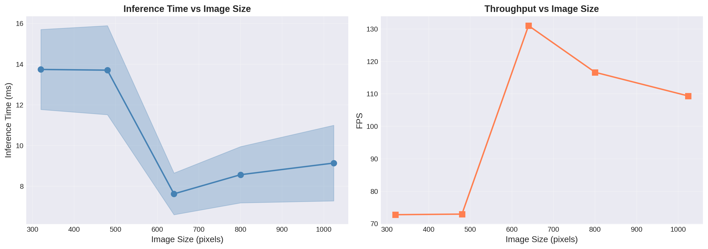
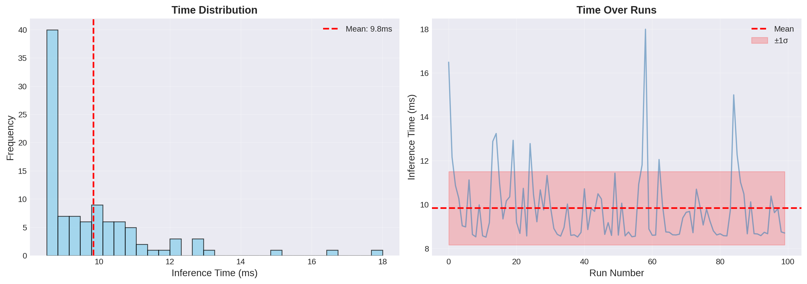
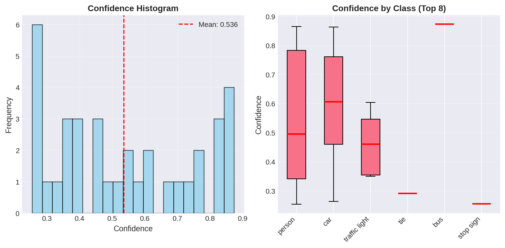
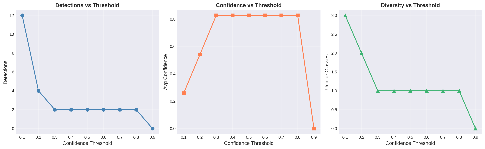
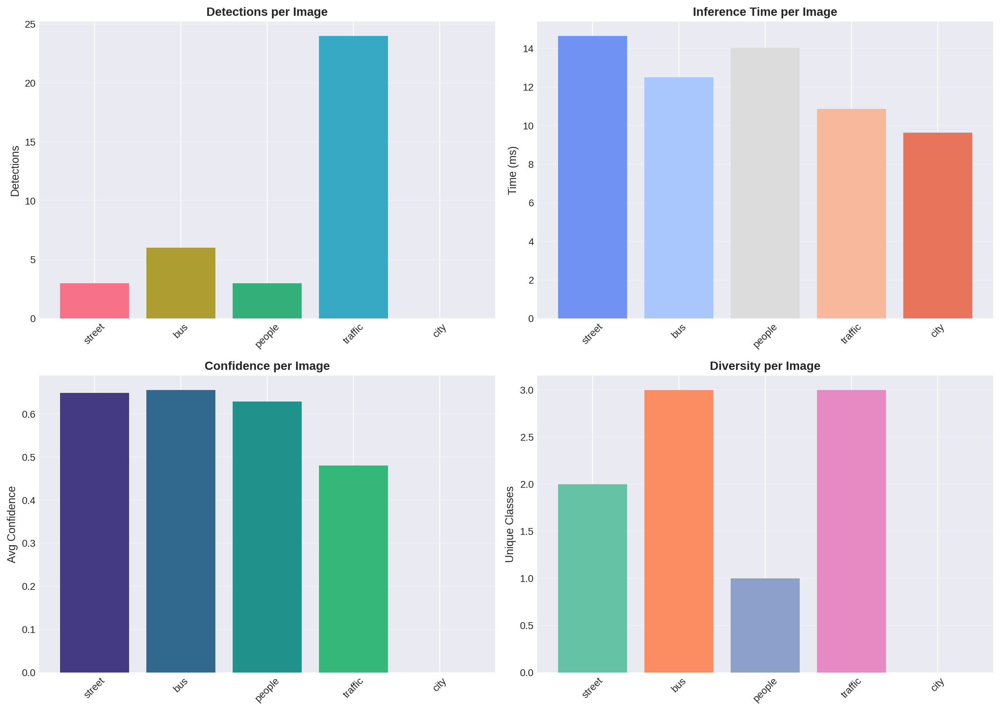

# YOLOv8 Object Detection

[](https://www.python.org/downloads/)
[](https://pytorch.org/)
[](https://ultralytics.com/)
[](https://opensource.org/licenses/MIT)
[](https://fastapi.tiangolo.com/)

Real-time object detection using **YOLOv8** from Ultralytics. Production-ready implementation with Python API, REST endpoints, and comprehensive visualization tools.

## Features

- **State-of-the-art Detection**: YOLOv8 architecture with 80 COCO classes
- **Multiple Model Sizes**: Nano, Small, Medium, Large, and Extra-Large variants
- **REST API**: FastAPI-powered endpoints for production deployment
- **Real-time Processing**: 131+ FPS on 640x640 images (GPU)
- **Video Support**: Process videos and webcam streams
- **Visualization Tools**: Built-in annotation and statistical analysis
- **Export Options**: ONNX, TensorRT, CoreML, and more

## Performance

| Model | Size | mAP50-95 | Speed (ms) | FPS |
|-------|------|----------|------------|-----|
| YOLOv8n | 640 | 37.3 | 7.6 | **131** |
| YOLOv8s | 640 | 44.9 | 11.2 | 89 |
| YOLOv8m | 640 | 50.2 | 18.7 | 53 |
| YOLOv8l | 640 | 52.9 | 28.8 | 35 |
| YOLOv8x | 640 | 53.9 | 42.1 | 24 |

*Tested on NVIDIA Tesla T4 GPU*

### Performance Benchmark



*Inference time and throughput across different image sizes*

### Timing Analysis



*Consistent inference timing with mean of 9.8ms across 100 runs*

## Experiment Results

### Confidence Analysis



*Distribution of detection confidences and per-class confidence boxplots*

### Threshold Effects



*Impact of confidence threshold on detections, average confidence, and class diversity*

### Per-Image Statistics



*Detailed breakdown of detections, inference time, confidence, and diversity per test image*

## Quick Start

### Installation

```bash
# Clone repository
git clone https://github.com/dhruv-atomic-mui21/yolov8-object-detection.git
cd yolov8-object-detection

# Install dependencies
pip install -r requirements.txt
```

### Basic Usage

```python
from src.detector import YOLOv8Detector

# Initialize detector
detector = YOLOv8Detector(weights='yolov8n.pt', conf_threshold=0.5)

# Detect objects
results = detector.detect('image.jpg')

# Print results
for det in results:
    print(f"{det['class_name']}: {det['confidence']:.2f}")
```

### CLI Usage

```bash
# Detect on image
python main.py --source image.jpg --weights yolov8n.pt

# Detect on video
python main.py --source video.mp4 --output results/

# Webcam detection
python main.py --source 0 --no-show
```

### API Usage

```bash
# Start server
uvicorn api.app:app --host 0.0.0.0 --port 8000

# Test endpoint
curl -X POST "http://localhost:8000/detect" \
     -F "file=@image.jpg" \
     -H "accept: application/json"
```

## Project Structure

```
yolov8-object-detection/
├── api/                    # REST API
│   ├── app.py             # FastAPI application
│   └── schemas.py         # Pydantic models
├── assets/                # Visualization images
├── configs/
│   └── config.yaml        # Configuration
├── notebooks/
│   └── yolov8_detection.ipynb  # Demo notebook
├── reference/             # Experiment data files
├── scripts/
│   ├── download_weights.py
│   ├── prepare_data.py
│   └── train.py
├── src/
│   ├── detector.py        # Main detector class
│   ├── model.py           # Model utilities
│   ├── utils.py           # Helper functions
│   └── visualize.py       # Visualization tools
├── tests/
│   └── test_detector.py   # Unit tests
├── Dockerfile             # Docker configuration
├── main.py                # CLI entry point
├── requirements.txt       # Dependencies
└── README.md
```

## Configuration

Edit `configs/config.yaml`:

```yaml
model:
  weights: "yolov8n.pt"    # Model: yolov8n/s/m/l/x.pt
  conf_threshold: 0.5      # Confidence threshold
  iou_threshold: 0.45      # NMS IoU threshold
  img_size: 640            # Input size
  device: null             # null = auto (cuda/cpu)
```

## Docker

```bash
# Build image
docker build -t yolov8-detection .

# Run API server
docker run -p 8000:8000 yolov8-detection

# Run with GPU
docker run --gpus all -p 8000:8000 yolov8-detection
```

## Testing

```bash
# Run all tests
pytest tests/ -v

# Run with coverage
pytest tests/ --cov=src --cov-report=html
```

## Tech Stack

- **Deep Learning**: PyTorch, Ultralytics YOLOv8
- **Computer Vision**: OpenCV, Pillow
- **API**: FastAPI, Uvicorn
- **Visualization**: Matplotlib, Seaborn
- **Testing**: Pytest

## API Endpoints

| Endpoint | Method | Description |
|----------|--------|-------------|
| `/` | GET | Health check |
| `/health` | GET | Service status |
| `/model/info` | GET | Model information |
| `/detect` | POST | Detect objects in image |
| `/detect/visualize` | POST | Return annotated image |
| `/detect/batch` | POST | Batch detection (max 10) |

## License

This project is licensed under the MIT License - see the [LICENSE](LICENSE) file for details.

## Acknowledgments

- [Ultralytics](https://ultralytics.com/) for YOLOv8
- [COCO Dataset](https://cocodataset.org/) for training data

## Contact

For questions or feedback, please open an issue on GitHub.

---

**Made using YOLOv8 and Ultralytics**
